# OIDC/OAuth2 Proxy for Hyperledger Fabric Blockchain

fabric-oidc-proxy allows authenticating to [Hyperledger Fabric blockchain](https://github.com/hyperledger/fabric) using OIDC token. It gets, on behalf of OIDC tokenholder (humans, programs, etc), a membership (x509) certificate issued by Fabric CA, and signs transactions using their respective certificate.



## Prerequisites
- Hyperledger Fabric network. For quickstart, checkout our [helm-charts](https://github.com/edgeflare/helm-charts))
- OIDC/OAuth2 provider that allows to add custom claims (We're using [ZITADEL](https://github.com/zitadel/zitadel))

### Quickstart
```shell
go build -o fabric-oidc-proxy .
./fabric-oidc-proxy start --port=8080
```

Register and Enroll a user with the OIDC proxy
```shell
export FABRIC_PROXY_API=http://localhost:8080/api/v1
```

```shell
curl -X POST -H "authorization: Bearer $TOKEN" $FABRIC_PROXY_API/account/enroll
```

## Interacting with the Hyperledger Fabric network
[example using asset-transfer chaincode-as-a-service](./example-ccaas/)

```shell
export TX_URL=$FABRIC_PROXY_API/default/assetcc/submit-transaction
```

- InitLedger
```shell
curl -H "authorization: Bearer $TOKEN" -X POST -d '{"name": "InitLedger","args": []}' $TX_URL
```

- GetAllAssets
```shell
curl -H "authorization: Bearer $TOKEN" -X POST -d '{"name": "GetAllAssets","args": []}' $TX_URL
```

- CreateAsset
```shell
curl -H "authorization: Bearer $TOKEN" -X POST -d '{"name": "CreateAsset","args": ["demo-id-01", "blue", "10", "Sam", "100"]}' $TX_URL
```

- UpdateAsset
```shell
curl -H "authorization: Bearer $TOKEN" -X POST -d '{"name": "UpdateAsset","args": ["demo-id-01", "blue", "10", "Sam", "1000"]}' $TX_URL
```

- DeleteAsset
```shell
curl -H "authorization: Bearer $TOKEN" -X POST -d '{"name": "DeleteAsset","args": ["demo-id-01"]}' $TX_URL
```
